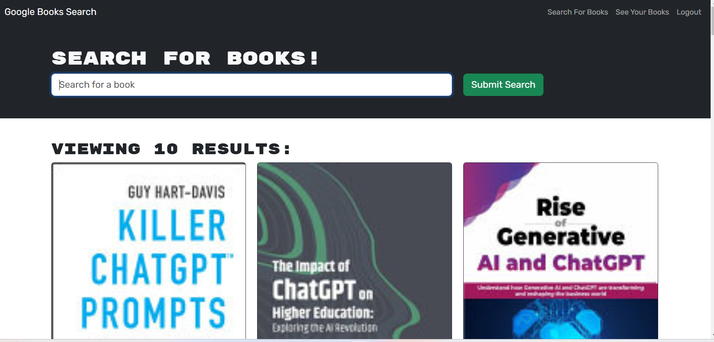
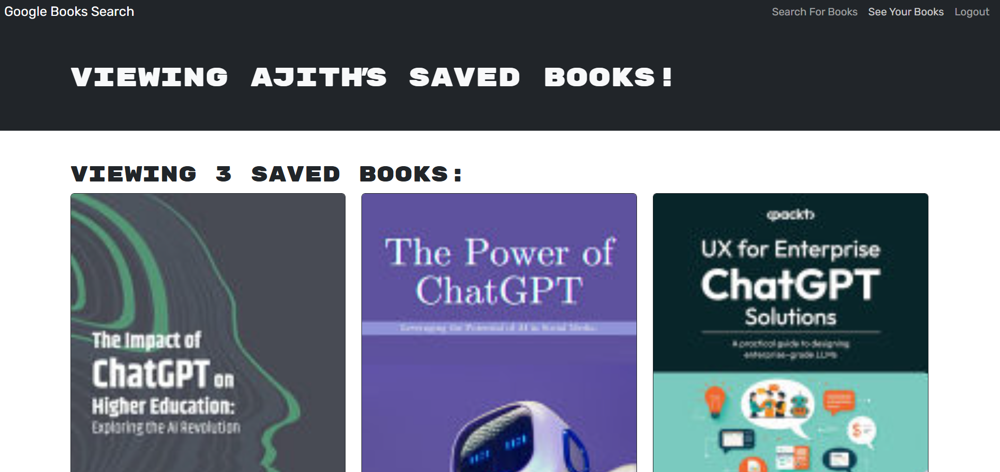

# Google Book Search
This project is a refactored version of a Google Books API search engine. It replaces the original RESTful API with a GraphQL API built using Apollo Server. The app leverages the MERN stack (MongoDB, Express.js, React, and Node.js) and includes user authentication, the ability to search for books, and save them to a personalized account.

The app allows users to:

Search for books using the Google Books API.
Save books to their accounts when logged in.
View and manage their saved books.

Features
User Experience
Homepage:

A navigation menu with options: Search for Books and Login/Signup.
A search input field with a submit button.
Search for Books (Public):

Enter a search term and see a list of results.
Results include each book's title, author, description, image, and a link to the book on Google Books.
Login/Signup Modal:

Signup Tab:
Input fields for username, email, and password.
A button to create an account and log in.
Login Tab:
Input fields for email and password.
A button to log in to an existing account.
Logged-In Features:

Navigation menu changes to Search for Books, Saved Books, and Logout.
Search results include a Save button for each book to add it to the user's account.
Saved books can be viewed, including details and a Remove button.
Logout:

The user is logged out and the navigation menu reverts to public options.

Mutation and Queries 

Query type:

me: Which returns a User type.
Mutation type:

login: Accepts an email and password as parameters; returns an Auth type.

addUser: Accepts a username, email, and password as parameters; returns an Auth type.

saveBook: Accepts a book author's array, description, title, bookId, image, and link as parameters; returns a User type. (Look into creating what's known as an input type to handle all of these parameters!)

removeBook: Accepts a book's bookId as a parameter; returns a User type.

## Table of Contents 
- [Google Book Search](#google-book-search)
  - [Table of Contents](#table-of-contents)
  - [Installation](#installation)
  - [Usage](#usage)
  - [Demo](#demo)
  - [ScreenShots](#screenshots)
  - [License](#license)
  - [Questions](#questions)

## Installation
1. Clone the repository:
    git clone git@github.com:gitkaviyarasi/GoogleBooksSearch.git
2. Navigate to the project directory and create a branch and open Code editor.
3. Install the package using npm i
4. setup the Db Dbname,username, password,JWT token in the .env file
5. then run the code by building using the `npm run build` and `npm run develop` 
   
## Usage
Run `npm run develop` and navigate to the prompted URL to see your app in dev. 

The apollo sever can be accessed by using the [lo](http://localhost:3001/graphql)
to test the mutations and queries.

## Demo
The App is deployed to Render, Click the below link for working application.
[https://kanbanboard-bfk5.onrender.com/ ](https://googlebookssearch-ve4k.onrender.com)

## ScreenShots
The following image demonstrates the web application's appearance:

## License
MIT

## Questions
If you have any questions about this project, feel free to reach out:

GitHub: gitkaviyarasi 
Email: kaviyarasikrishnannj@gmail.com
